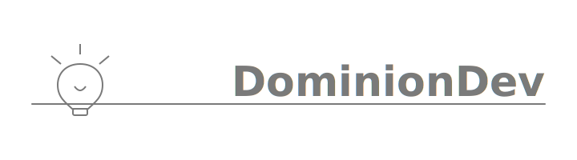

# Hi, i'm DominionDev 👋

  

## 🧑‍💻 Who Am I?

I’m a developer who lives in the terminal.

I build:

- CLI tools
- Developer utilities
- UIs in the terminal (TUIs)
- Lightweight backend services
- Tools that make other developers faster

If it runs in the Terminal, I’m interested.

---

## 🖥 My Development Stack

### Languages
- Go
- Rust
- Python

### What I Enjoy Using
- Charm ecosystem ([Bubble Tea](https://github.com/charmbracelet/bubbletea), [Lip Gloss](https://github.com/charmbracelet/lipgloss), [Gum](https://github.com/charmbracelet/gum), and [more](https://github.com/charmbracelet))
- Unix philosophy
- Clean command interfaces
- Structured logging
- Small composable tools

---

## 🚀 Projects

### 🧩 [lean](https://github.com/dominionthedev/lean)
A smart tool for managing env files
Built in Go, uses Charm [lipgloss](https://github.com/charmbracelet/lipgloss), [fang](https://github.com/charmbracelet/fang), [huh](https://github.com/charmbracelet/huh), and [Cobra](https://github.com/spf13/cobra)

### 🤔 [logically](https://github.com/leraniode/x-py)
A logic-construction toolkit for building logic, logically 🤔.
Built in Python, uses no deps(Yes, no dependencies))

### 🍫 [choco](https://github.com/leraniode/x-py)
A little flavoured events and action module 🍫
Built in Python, uses no deps

### 🧠 [illygen](https://github.com/leraniode/illygen)
A Library and Runtime for building an Intelligence System
Built in Go, no deps

### 🪵 [logfmt](https://github.com/dominionthedev/logfmt)
A simple, little CLI tool for formatting, colourizing, and displaying Logs
Built in Go, uses Charm [log](https://github.com/charmbracelet/log), [fang](https://github.com/charmbracelet/fang) and [Cobra](https://github.com/spfi3/cobra)

---

## 🧠 Philosophy

- Tools should feel fast and alive.
- Interfaces should be beautiful and stylish.
- Simplicity and Modularity scales.
- Open source matters.

I build tools I can use.

---

## 🛠 Environment

- MacOS
- NeoVim
- Tmux
- ITerm and Alacritty
- Terminal over everything

---

## 🌱 Open Source

I love learning and building in the open.
I believe Open Source is the future and the power of Development

